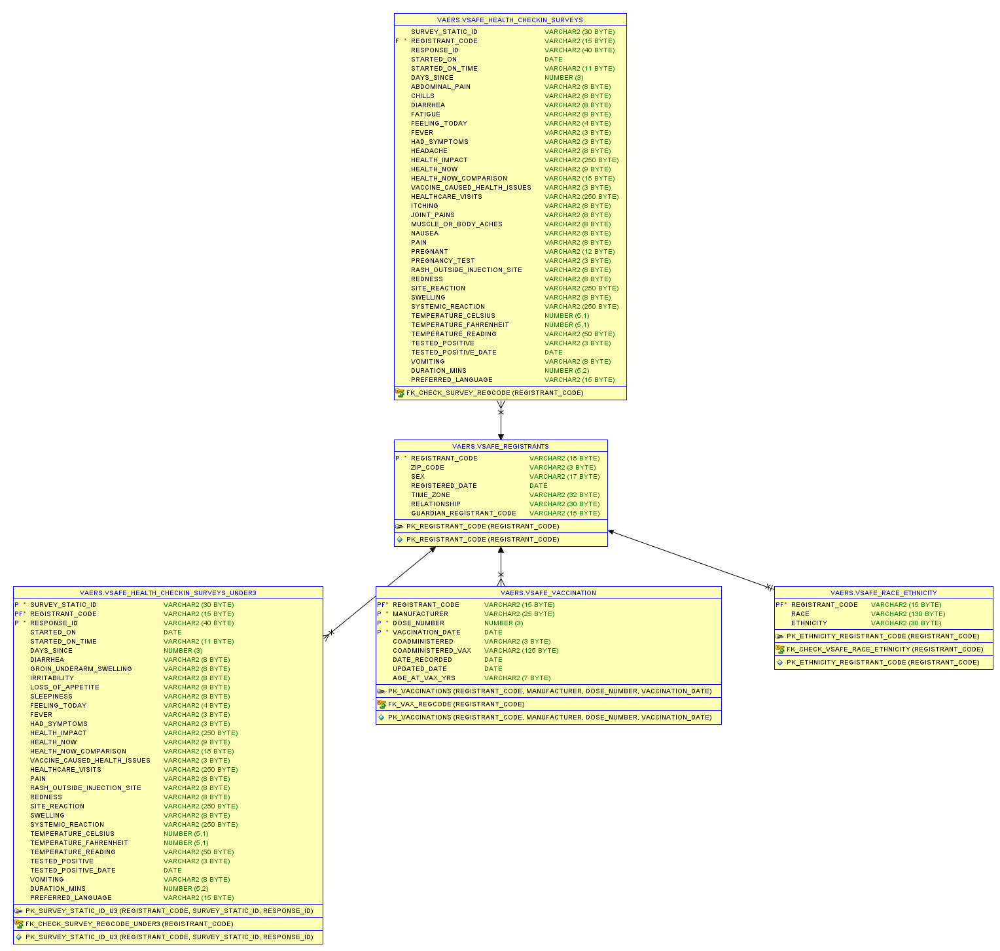

# VAERS & V-SAFE Data Analysis Repository

A repository for analyzing and managing Vaccine Adverse Event Reporting System (VAERS) and V-SAFE data. This includes SQL scripts for creating database tables, defining constraints, and adding metadata documentation for effective data integration and analysis.

## Overview

The **Vaccine Adverse Event Reporting System (VAERS)** is a national passive surveillance system co-administered by the U.S. Food and Drug Administration (FDA) and the Centers for Disease Control and Prevention (CDC). VAERS collects and monitors reports of adverse events following vaccination to detect potential safety signals and identify rare or unusual vaccine adverse events.

The **v-safe COVID-19 dataset**, provided by the **Centers for Disease Control and Prevention (CDC)**, contains de-identified data from the v-safe program—a smartphone-based system that monitors the safety of COVID-19 vaccines in the United States.

---
---

### VAERS Key Features
- **Data Access**: Oracle Object Storage External Data access through External Tables.
- **ETL**: Data optimized into native Oracle tables via external table SELECT INTO statments.
- **SQL Scripts**: Includes scripts to create database tables (`VAERSDATA`, `VAERSVAX`, `VAERSSYMPTOMS`) with associated constraints.
- **Metadata Documentation**: Comments and descriptions for each column and table based on official VAERS documentation.
- **Referential Integrity**: Implements primary and foreign key relationships to maintain data consistency.
  
### VAERS Data Components
1. **VAERS_DATA**: Core patient and report information, including demographics and outcomes.
2. **VAERS_VAX**: Details about administered vaccines, such as vaccine type, manufacturer, and lot number.
3. **VAERS_SYMPTOMS**: MedDRA-coded symptoms reported in adverse events, providing a standardized view of symptom data.

### VAERS Data Source
- VAERS csv data updates monthly and is typically four weeks behind current date.
- https://vaers.hhs.gov/data/datasets.html

### VAERS Schema Entity Relationship Diagram

---
---

### v-safe COVID-19 Key Features
- **Data Access**: Oracle Object Storage External Data access through External Tables.
- **ETL**: Data optimized into native Oracle tables via external table SELECT INTO statments.
- **SQL Scripts**: Includes scripts to create database tables (`VSAFE_RACE_ETHNICITY`, `VSAFE_HEALTH_CHECKIN_SURVEYS_UNDER3`, `VSAFE_VACCINATION`, `VSAFE_HEALTH_CHECKIN_SURVEYS`, `VSAFE_REGISTRANTS`) with associated constraints.
- **Metadata Documentation**: Comments and descriptions for each column and table based on official vsafe COVID-19 documentation.
- **Referential Integrity**: Implements primary and foreign key relationships to maintain data consistency.
  
### v-safe COVID-19 Components
1. **VSAFE_REGISTRANTS**: Registrant's Descriptive Information.
2. **VSAFE_VACCINATION**: Vaccination & Vaccine Information.
3. **VSAFE_HEALTH_CHECKIN_SURVEYS**: Health Checkins for those 3 years or older at first dose.
4. **VSAFE_HEALTH_CHECKIN_SURVEYS_UNDER3**: Health Checkins for those under 3 years of age at first dose.
5. **VSAFE_RACE_ETHNICITY**: Race/Ethnicity Information

### v-safe COVID-19 Data Source
- https://data.cdc.gov/Public-Health-Surveillance/v-safe-COVID-19/dqgu-gg5d/about_data
- https://healthdata.gov/dataset/v-safe-COVID-19/gcmw-987r/about_data

### V-Safe Schema Entity Relationship Diagram

---
---

##  Table List
### External Tables
- `EXT_VAERS_DATA`
- `EXT_VAERS_SYMPTOMS`
- `EXT_VAERS_VAX`
- `EXT_VSAFE_HEALTH_CHECKIN_SURVEYS`
- `EXT_VSAFE_HEALTH_CHECKIN_SURVEYS_UNDER3`
- `EXT_VSAFE_RACE_ETHNICITY`
- `EXT_VSAFE_REGISTRANTS`
- `EXT_VSAFE_VACCINATION`

### Missing Data Tables
- `MISSING_VAERS_DATA_FROM_VAERS_SYMPTOMS`
- `MISSING_VAERS_DATA_FROM_VAERS_VAX`

### VAERS Tables
- `VAERS_DATA`
- `VAERS_SYMPTOMS`
- `VAERS_VAX`

### v-safe Tables
- `VSAFE_HEALTH_CHECKIN_SURVEYS`
- `VSAFE_HEALTH_CHECKIN_SURVEYS_UNDER3`
- `VSAFE_RACE_ETHNICITY`
- `VSAFE_REGISTRANTS`
- `VSAFE_VACCINATION`

---

## Data Workflow
- Create Credentials to Access Object Storage
- Create External Tables and validate data
- Create Tables and load tables from external tables
- Oracle Analytics Workbook Create
- [master_script](https://github.com/BitKind/vaers/blob/main/master_script.sql) can be used to execute all scripts in required order.

---

## Terraform Objects (future)
- VCN
- Autonomous
- Oracle Analytics
  
---
## Oracle Cloud (OCI)
- [Create an Oracle Free Tier Account](https://github.com/BitKind/vaers/blob/main/GetOracleFreeTier.md)

---

## Notes
- vaers_data: load error - approximately 9 rows - Error preserved in VALIDATE$ tables
- vaers_vax: 14 rows deleted - preserved in MISSING_VAERSDATA_FROM_VAERSVAX;
- vaers_symptoms: 17 rows deleted - preserved in MISSING_VAERSDATA_FROM_VAERSSYMPTOMS;
- Future source file updates may require additional External table debugging
- Bucket Referenced in Code is public, but limited lifespan so may go away in near future
- Autonomous Database - create time approximately 1 hour with 2 OCPU 

